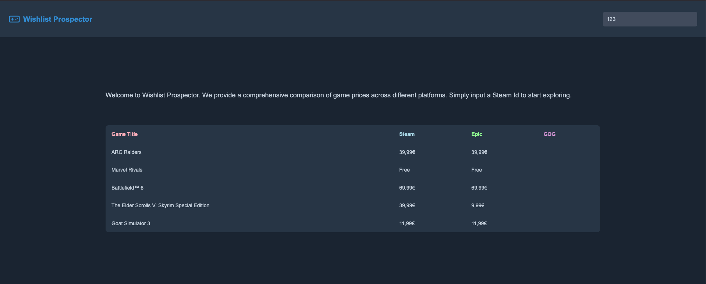

# bottomless-box



## 🔗 Live Demo

https://wishlist-prospector.onrender.com/

## 📝 Overview

Wishlist Prospector is a small demo application built to learn Apify’s Crawlee web scraping library. The original idea was to compare prices of games on a user’s Steam wishlist across different stores. Over time, Steam and Epic’s APIs and site structures shifted, and a real production system would use the Epic Games public API instead of scraping.

Still, the project successfully served its real purpose:
learning some basic concepts of web automation, the Crawlee library, Playwright integration, and basic data storage usage in a simple demo.

## 🎯 Project Goals

- Get practical experience with Crawlee (routing, request handling, retry logic, `KeyValueStore`, `PlaywrightCrawler`).

- Use Web fundamentals only — no Express, no frontend library or frameworks.

- Build a minimal demo that fetches Steam wishlist data, enriches it with scraped Epic Games store data, and displays results in a basic UI.

- Work through documentation, examples, and Apify Academy materials in a hands-on way.

## 🛠️ Tech Stack

- Node.js (built on core `http` module – no Express)

- TypeScript

- Crawlee (+ PlaywrightCrawler)

- HTML `<template>` elements on the frontend (no library or frameworks)

## 📦 Key Dependencies

```
crawlee: ^3.0.0
playwright: *
ts-node: ^10.9.2
```

## 📁 Project Structure

```
.
├── Dockerfile
├── package.json
├── assets
│   ├── wishlist-prospector-screenshot.png
├── src
│   ├── client
│   │   ├── index.html
│   │   ├── script.js
│   │   └── styles.css
│   ├── helpers.ts
│   ├── middleware
│   │   ├── handleSearchRequest.ts
│   │   ├── handleStaticFileRequest.ts
│   │   └── queries.gql
│   ├── scraper
│   │   ├── main.ts
│   │   └── routes.ts
│   └── server.ts
└── tsconfig.json
```

### How the pieces fit together

- `server.ts` handles all HTTP requests.

- `/search` requests trigger a workflow:

  1. Fetch the user’s Steam wishlist

  2. Fetch Steam app details for each game

  3. Store everything in a Crawlee `KeyValueStore`

  4. Run a `PlaywrightCrawler` to look up matching Epic Games data

  5. Return the combined Steam + Epic results as JSON

- The frontend renders rows using an HTML `<template>` element.

## 🧭 Crawling Workflow

The scraping step is intentionally simple:

- Build search URLs for Epic Games using the Steam game names

- Crawl the results page with `PlaywrightCrawler`

- Extract possible price values and other relevant data using locators

- Perform lightweight matching (title similarity, developers, release date)

- Store Epic data back into the `KeyValueStore` under the same game ID

This gave me hands-on familiarity with Crawlee features such as:

- Request queue initialization

- Passing `userData` to handlers

- Using router functions

- Handling retries

- Working with Playwright alongside Crawlee

- Using persistent `KeyValueStore` data across the workflow

## 🚀 Run Commands

- Start server + crawler in dev mode:
  `npm run dev`

- Run crawler only:
  `npm run crawler`

- Build TypeScript:
  `npm run build`

## 🛠️ Development Setup

1. Install Node.js (18+ recommended)

2. Install project dependencies: `npm install`

3. Start the dev server: `npm run dev`

4. Open http://localhost:8000 and provide a Steam Profile ID
   (a demo ID is used automatically if none is provided. Just enter any input in the searchbar and submit)
   - If you wish to use your own Steam wishlist, you must make both the profile and the game details settings public, which can be set here: `https://steamcommunity.com/profiles/YOUR_STEAM_PROFILE_ID/edit/settings`

## ⚠️ Notes and Limitations

Some Steam API endpoints and Epic Games page structures changed during development.

A production version of a similar price aggregator app would rely on the Epic Games Store API instead of scraping most likely.

Price matching between stores is intentionally simplistic — this project is about learning Crawlee, not solving price aggregation comprehensively.

Game matching can fail if Steam/Epic metadata differs significantly. The matching functions are homegrown and unsophisticated

Still, these constraints made it a realistic and helpful environment for practicing scraper resilience, identifying reliable locators, constructing a routing pattern, and debugging.

## License


